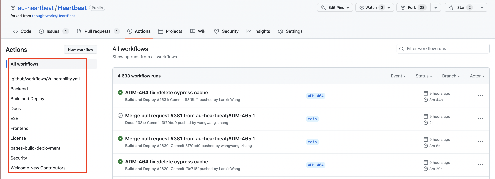
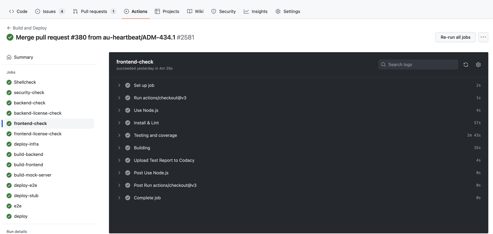
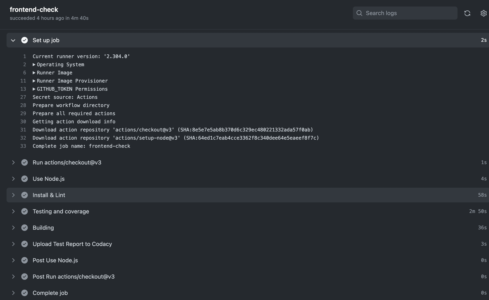
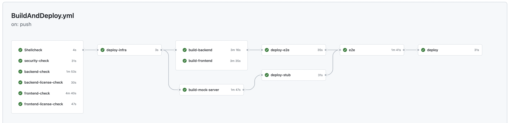

## 使用 Git Action 实现CI/CD
有关于CI/CD的概念，想必大家都非常熟悉。今天跟大家分享这篇文章，主要是想分享记录一下，在HeartBeat内部项目中，我们怎么实现代码的CI/CD的。我主要从以下几方面来跟大家分享。
1. CI/CD的简单概述
2. 部署CI/CD的工具
3. GitHub Actions以及Why use it?
4. How to use GitHub Action?
### CI/CD
CI指持续集成（Continuous Integration）
CD指持续交付/持续部署（Continuous Delivery/Continuous Deployment）的缩写。
持续集成是指在开发过程中，团队成员经常地提交代码到一个共享代码仓库中，然后自动地进行构建、测试、代码质量检查等流程，以尽早地发现和解决潜在的问题。
持续交付/持续部署则是指将已经通过了所有自动化测试的代码，自动地部署到生产环境中，以提高软件交付的速度和质量，并且可以快速地响应客户需求和反馈。

### 部署CI/CD的工具
部署 CI/CD 的工具有很多，下面我就简单列举一些主流的工具及其优缺点.

| 工具名 | 优点 | 缺点 |
| ------ | ------ | ------ |
| Jenkins | 开源、免费、功能强大、插件丰富，可与各种工具集成，支持多个操作系统。 | 需要自己维护和扩展。|
| Travis CI | 适用于开源项目，易于设置和使用，集成度高，支持多种编程语言和框架。 | 需要付费才能获得更高级别的功能和支持。|
| GitHub Actions | 与GitHub 版本控制系统无缝集成，可以轻松配置和触发 CI/CD 流程 | 如果需要更高的并发能力，则需要升级到付费版本；相比一些专业的 CI/CD 工具，GitHub Actions 在某些高级功能和自定义配置方面可能受到一定的限制。|
| BuildKite |简单易用，可扩展性，可视化界面 | 需要自行设置和维护服务器资源，需要编写配置文件，可能会受限于插件和集成的可用性。|
### Git Action
GitHub Actions是一个持续集成和持续部署（CI/CD）平台，由GitHub提供。使用GitHub Actions，可以在代码存储库中配置和自动化软件开发生命周期中的工作流程，包括测试、构建和部署。
HeartBeat是我司的内部项目，其是一种了解项目交付情况的工具，可帮助团队确定绩效指标，从而推动持续改进并提高团队生产力和效率。因此团队还不是完全获取一些付费资源的支持。基于此，我们选择GitHub Actions部署项目CI/CD，并且免费的资源完全支持项目当前运行。
### 如何使用Git Action部署CI/CD
1. 在你的GitHub上的存储库中创建一个目录.github/workflows
2. 在该.github/workflows目录中，创建一个名为buildAndDeploy.yml的文件
3. feature branch 触发流水线状态？
4. main branch 触发流水线？
5. 不同条件下触发的job不同.[stub] [infra] [docs]
6. 不同jobs里边的依赖关系
7. 将当前内容commit并push至仓库，创建pull request。工作流提交到存储库中的分支会触发事件push并运行工作流。 至此，一个简单的CI/CD就部署成功啦。

那如何快速查看工作流程结果呢？ 这里将以HeartBeat CI/CD部署为例，查看工作流程结果。
  - 进入GitHub仓库主页，单击 Actions
  
  - 在左侧边栏中，单击要显示的工作流.
  
  - 从工作流程运行列表中，单击要查看的运行名称，以为“frontend checked举例，正在测试 GitHub Actions”。
  
  - 日志显示每个步骤是如何处理的。展开任何步骤以查看其详细信息。
   
  - 以下是HeartBeat完整CI/CD workFlows
    

