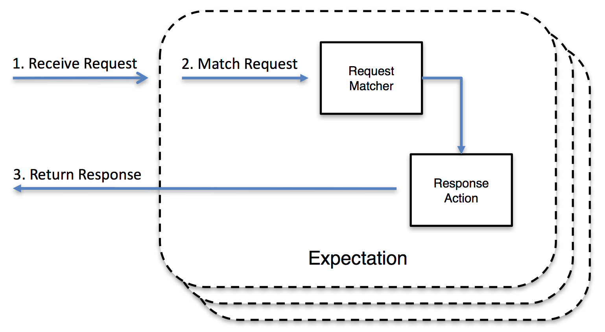
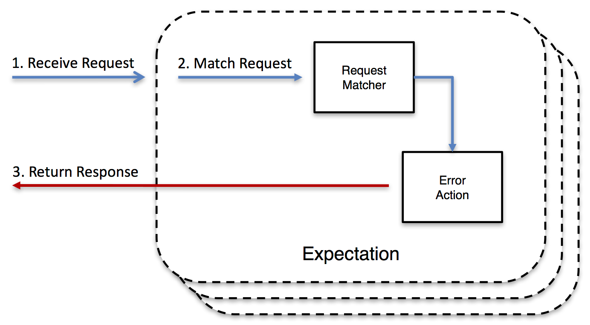

## 概述

在软件开发和测试过程中，为了提高效率并减少对实际服务的依赖，我们常常使用存根服务器（Stub Server）和模拟服务器（Mock Server）这两种工具。存根服务
器和模拟服务器都是用于模拟外部依赖项的行为，但它们有不同的实现方式和用途。  

本文将介绍存根服务器和模拟服务器的概念、为什么要使用存根服务器和模拟服务器，它们的优势和用途，以及如何在开发和测试中使用它们来提高效率和可靠性。  

## Mock Server

### 什么是Mock Server？

Mock Server是一种模拟服务器，用于模仿API的真实行为。它通过模拟真实的服务，为来自客户端的请求提供真实响应。在开发和测试中，Mock Server发挥着重要的
作用。 它可以在本地计算机或云服务器上运行，拦截应用程序发出的请求，并返回预定义的响应。

### 为什么要使用Mock Server？

1. 提高开发效率  
   在开发过程中，某些依赖的服务可能尚未准备就绪或不可访问。使用Mock server可以模拟这些服务的行为，使开发人员能够继续工作而不会受到阻碍。有助于前端
   和后端开发人员在服务尚未准备好或不可用的情况下独立进行开发。
   前端团队可以利用Mock Server模拟API响应，无需等待实际后端服务的就绪，从而节省时间和资源，加快开发和测试周期。
   同时，Mock Server的使用使前端和后端开发人员能够并行开发，因为它们可以依据预定义的API规范和模拟响应进行工作，而无需相互依赖。
   这种独立且并行的开发方式提高了团队的整体效率，并促进了协作的灵活性和敏捷性。

2. 模拟各种场景  
   Mock Server可以模拟各种请求和响应场景，包括成功响应、错误响应、边界条件和异常情况。这样可以更全面地测试应用程序的行为，提高应用程序的质量和可靠性。

3. 隔离和独立性
   Mock server允许开发人员将应用程序与外部依赖项（如第三方API或服务）隔离开来，从而使开发和测试更加独立和可控。这样可以避免对实际服务产生不必要的
   依赖，提高开发效率和测试可靠性。

4. 性能测试和负载测试
   Mock server可以用于模拟高负载条件，从而进行性能测试和负载测试，以评估应用程序在真实环境中的表现。 

   总的来说，Mock Server的使用可以提高开发效率，支持并行开发，模拟各种场景，隔离依赖服务，并用于性能测试和负载测试。它是一个强大的工具，帮助开发人
员构建和测试应用程序，同时降低对实际服务的依赖性。

### 如何搭建Mock server？
搭Mock Server的方式有很多种，以下是一些常见的方式：

1. 使用Mock Server框架：有许多专门用于搭建Mock Server的框架可供选择，例如MockServer、Prism、WireMock等。这些框架提供了简单易用的接口和配置
选项，可以快速搭建和配置Mock Server。

2. 自定义代码：可以使用编写程序语言（如Java、Python、Node.js等）来编写自定义的模拟服务器，处理来自客户端的请求，并返回预定义的响应。

3. 使用API开发工具：一些API开发工具（如Postman、Swagger等）提供了Mock Server的功能。可以使用这些工具创建和管理Mock API，并根据需要配备设置请
求和响应。

### 常用框架

#### **MockServer**  
1. 介绍
   MockServer 是一个开源模拟服务器框架，允许开发人员模拟 API 的行为。它为模拟 HTTP、HTTPS 和其他协议提供了一个强大而灵活的平台，使其适用于测试
和开发目的。对于通过 HTTP 或 HTTPS 集成的任何系统，MockServer 可用作：
   - 模拟服务器：可以配置MockServer以针对不同的请求返回特定的响应。通过模拟真实系统的行为，MockServer能够提供一致和可控的响应，以便进行系统间的
集成测试或开发。 
   - 代理服务器：MockServer可以作为代理服务器使用，记录并可选择性地修改请求和响应。它可以拦截客户端发送的请求，并将其转发到实际的目标服务器，同时
还可以记录请求和响应的详细信息。这对于调试和监视请求的流量以及对请求和响应进行自定义处理非常有用。 
   - 同时作为代理和模拟服务器：MockServer可以同时充当代理服务器和模拟服务器。这意味着它可以根据请求的类型将其转发到实际的目标服务器或返回预定义的
响应。这种灵活性使得可以在同一个系统中同时模拟一部分请求并代理另一部分请求，以满足不同的测试或开发需求。 

   对于每个接收到的请求，会按照以下步骤进行处理： 
   - 查找匹配的预期并执行相应的操作。 
   - 如果没有匹配的预期，则将请求作为代理请求。 
   - 如果不是代理请求，则返回 404 响应。  

   MockServer 支持以下操作：   
   - 当请求符合预期时返回"模拟"响应  
     
   - 当请求符合预期时转发请求（即动态端口转发代理）  
     
   - 当请求匹配预期时执行回调，允许动态创建响应  
     
   - 当请求符合预期时返回无效响应或关闭连接  
     

2. 运行MockServer
   MockServer 非常灵活，支持多种使用模式：
   - 通过@Before或@After方法中的Java API以编程方式
   - 在JUnit4测试中通过@Rule注释字段使用JUnit4 @Rule
   - 通过@ExtendWith注释的JUnit5类使用JUnit5测试扩展
   - 通过带@MockServerTest注释的测试类使用Spring Test Execution Listener
   - 作为任何支持Docker的环境中的Docker容器
   - 通过任何Kubernetes环境中的Helm图表
   - 从命令行作为测试环境中的独立进程
   - 通过Maven插件作为Maven构建周期的一部分
   - 作为来自任何Node.js代码的Node.js (npm) 模块
   - 作为Grunt构建周期的一部分的Grunt插件
   - 作为现有应用程序服务器的可部署 WAR

## Stub Server

### 什么是Stub Server

服务存根是对实际服务的模拟，可用来在功能上替换测试环境中的服务。 存根服务器用于替换实际应用程序服务器。  
从客户机应用程序的角度来看，服务存根看起来与其模拟的实际服务相同。 要使用服务存根来替换实际服务，必须能够将客户机应用程序中原始服务的  
URL 替换为存根服务器的 URL。

### 为什么要使用Stub Server？

### 如何搭建Stub Server

## HeartBeat使用Stubby4j搭建Stub Server

HeartBeat使用Stubby4j作为存根服务器来构建我们的服务。所有第三方服务都存根在一个存根服务器中。

### 为何选择Stubby4j？

### 构建示例

