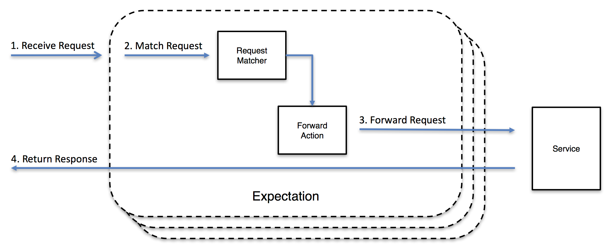
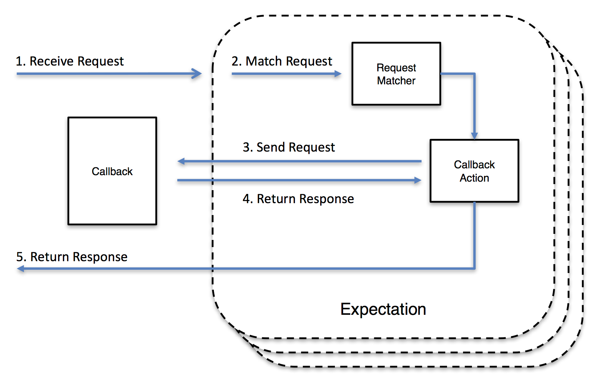

## 概述

在软件开发和测试过程中，为了提高效率并减少对实际服务的依赖，我们常常使用存根服务器（Stub Server）和模拟服务器（Mock Server）这两种工具。存根服务
器和模拟服务器都是用于模拟外部依赖项的行为，但它们有不同的实现方式和用途。  

本文将介绍存根服务器和模拟服务器的概念、为什么要使用存根服务器和模拟服务器，它们的优势和用途，以及如何在开发和测试中使用它们来提高效率和可靠性。  

## Mock Server

### 什么是Mock Server？

Mock Server是一种模拟服务器，用于模仿API的真实行为。它通过模拟真实的服务，为来自客户端的请求提供真实响应。在开发和测试中，Mock Server发挥着重要的
作用。 它可以在本地计算机或云服务器上运行，拦截应用程序发出的请求，并返回预定义的响应。

### 为什么要使用Mock Server？

1. 提高开发效率  
   在开发过程中，某些依赖的服务可能尚未准备就绪或不可访问。使用Mock server可以模拟这些服务的行为，使开发人员能够继续工作而不会受到阻碍。有助于前端
   和后端开发人员在服务尚未准备好或不可用的情况下独立进行开发。
   前端团队可以利用Mock Server模拟API响应，无需等待实际后端服务的就绪，从而节省时间和资源，加快开发和测试周期。
   同时，Mock Server的使用使前端和后端开发人员能够并行开发，因为它们可以依据预定义的API规范和模拟响应进行工作，而无需相互依赖。
   这种独立且并行的开发方式提高了团队的整体效率，并促进了协作的灵活性和敏捷性。

2. 模拟各种场景  
   Mock Server可以模拟各种请求和响应场景，包括成功响应、错误响应、边界条件和异常情况。这样可以更全面地测试应用程序的行为，提高应用程序的质量和可靠性。

3. 隔离和独立性
   Mock server允许开发人员将应用程序与外部依赖项（如第三方API或服务）隔离开来，从而使开发和测试更加独立和可控。这样可以避免对实际服务产生不必要的
   依赖，提高开发效率和测试可靠性。

4. 性能测试和负载测试
   Mock server可以用于模拟高负载条件，从而进行性能测试和负载测试，以评估应用程序在真实环境中的表现。 

   总的来说，Mock Server的使用可以提高开发效率，支持并行开发，模拟各种场景，隔离依赖服务，并用于性能测试和负载测试。它是一个强大的工具，帮助开发人
员构建和测试应用程序，同时降低对实际服务的依赖性。

### 如何搭建Mock server？
搭Mock Server的方式有很多种，以下是一些常见的方式：

1. 使用Mock Server框架：有许多专门用于搭建Mock Server的框架可供选择，例如MockServer、Prism、WireMock等。这些框架提供了简单易用的接口和配置
选项，可以快速搭建和配置Mock Server。

2. 自定义代码：可以使用编写程序语言（如Java、Python、Node.js等）来编写自定义的模拟服务器，处理来自客户端的请求，并返回预定义的响应。

3. 使用API开发工具：一些API开发工具（如Postman、Swagger等）提供了Mock Server的功能。可以使用这些工具创建和管理Mock API，并根据需要配备设置请
求和响应。

### 常用框架

#### **MockServer**  
1. 介绍
   MockServer 是一个开源模拟服务器框架，允许开发人员模拟 API 的行为。它为模拟 HTTP、HTTPS 和其他协议提供了一个强大而灵活的平台，使其适用于测试
和开发目的。对于通过 HTTP 或 HTTPS 集成的任何系统，MockServer 可用作：

   - 模拟服务器：可以配置MockServer以针对不同的请求返回特定的响应。通过模拟真实系统的行为，MockServer能够提供一致和可控的响应，以便进行系统间的
集成测试或开发。 

   - 代理服务器：MockServer可以作为代理服务器使用，记录并可选择性地修改请求和响应。它可以拦截客户端发送的请求，并将其转发到实际的目标服务器，同时
还可以记录请求和响应的详细信息。这对于调试和监视请求的流量以及对请求和响应进行自定义处理非常有用。 

   - 同时作为代理和模拟服务器：MockServer可以同时充当代理服务器和模拟服务器。这意味着它可以根据请求的类型将其转发到实际的目标服务器或返回预定义的
响应。这种灵活性使得可以在同一个系统中同时模拟一部分请求并代理另一部分请求，以满足不同的测试或开发需求。 

   对于每个接收到的请求，会按照以下步骤进行处理： 
   - 查找匹配的预期并执行相应的操作。 
   - 如果没有匹配的预期，则将请求作为代理请求。 
   - 如果不是代理请求，则返回 404 响应。  

   MockServer 支持以下操作：   
   - 当请求符合预期时返回"模拟"响应  
     
   - 当请求符合预期时转发请求（即动态端口转发代理）  
     
   - 当请求匹配预期时执行回调，允许动态创建响应  
     
   - 当请求符合预期时返回无效响应或关闭连接  
     

2. 运行MockServer
   MockServer 非常灵活，支持多种使用模式：
   - 通过@Before或@After方法中的Java API以编程方式
   - 在JUnit4测试中通过@Rule注释字段使用JUnit4 @Rule
   - 通过@ExtendWith注释的JUnit5类使用JUnit5测试扩展
   - 通过带@MockServerTest注释的测试类使用Spring Test Execution Listener
   - 作为任何支持Docker的环境中的Docker容器
   - 通过任何Kubernetes环境中的Helm图表
   - 从命令行作为测试环境中的独立进程
   - 通过Maven插件作为Maven构建周期的一部分
   - 作为来自任何Node.js代码的Node.js (npm) 模块
   - 作为Grunt构建周期的一部分的Grunt插件
   - 作为现有应用程序服务器的可部署 WAR

## Stub Server

### 什么是Stub Server

服务存根是对实际服务的模拟，可用来在功能上替换测试环境中的服务。 存根服务器用于替换实际应用程序服务器。  
从客户机应用程序的角度来看，服务存根看起来与其模拟的实际服务相同。 要使用服务存根来替换实际服务，必须能够将客户机应用程序中原始服务的  
URL 替换为存根服务器的 URL。

### 如何搭建Stub Server

要搭建一个 Stub Server 来模拟来自真实服务器的响应，可以按照以下步骤进行操作：

1. 选择合适的 Stub Server 工具：例如 WireMock、MockServer、JSON Server、stubby4j 等。

2. 定义预期的请求和响应：在搭建 Stub Server 之前，需要明确要模拟的请求和对应的响应。定义请求的路径、HTTP 方法、请求头、请求体等信息，以及预期的响应状态码、响应头、响应体等信息。

3. 配置 Stub Server：根据你选择的工具和其提供的文档，配置 Stub Server 来定义请求和响应的规则。通常可以使用配置文件、代码或 API 接口进行配置。

4. 启动 Stub Server：根据你选择的工具，启动 Stub Server。它会监听指定的端口，等待请求到达并返回预定义的响应。

5. 使用 Stub Server 进行测试：通过将客户端请求重定向到 Stub Server，可以测试客户端在与真实服务器交互时的行为。你可以在客户端配置中指定 Stub Server 的地址和端口，或者使用代理工具将请求重定向到 Stub Server。

通过搭建 Stub Server，你可以模拟来自真实服务器的响应，而无需实际发送请求到网络。这样可以方便地进行本地开发、测试和调试，而不受真实服务器的限制。

## HeartBeat 使用 stubby4j 搭建Stub Server

HeartBeat使用 stubby4j 作为存根服务器来构建我们的服务。所有第三方服务都存根在一个存根服务器中。

### 为何选择 stubby4j ？

   - 简单易用，配置使用YAML或JSON文件，对于简单的模拟场景可以快速上手。
   - 专注于HTTP和HTTPS服务的模拟和stubbing，可以快速创建stub并定义所需的响应。
   - 支持动态响应生成和JavaScript注入。
   - 可以运行在本地计算机上，不需要额外的服务器或环境。

总的来说，stubby4j更加简单易用，适合快速创建简单的模拟场景。

### 使用stubby4j HTTP 存根服务器的优点

1. 模拟来自真实服务器的响应并且不关心（或不能）通过网络发送请求

2. 在基于 Docker 的微服务架构中存根外部 Web 服务（在本地开发和测试时）

3. 当您依赖的外部 API 不存在或不完整时，避免对生产力产生负面影响

4. 模拟实际远程 API 无法可靠生成的 Web 服务的边缘情况和/或故障模式

5. 错误注入，在相同 URI 上的 X 次良好响应之后，Web 服务可以得到错误的响应

6. 验证用户的应用程序在 WebSocket 服务器推送时的行为是否符合预期

7. 验证用户代码是否使用所有必需的参数和/或标头发出 HTTP/1.1 或 HTTP/2（通过 TLS）请求

8. 验证用户代码是否正确处理 HTTP 响应错误代码

### 运行 Stub Server

#### 使用 JAR 存档运行

1. 下载 stubby4j：下载最新版本的 stubby4j [latest stubby4j version](https://search.maven.org/search?q=g:io.github.azagniotov%20AND%20a:stubby4j)。

2. 编写存根配置：创建一个 YAML 或 JSON 文件，用于定义存根的配置。在配置文件中，定义请求的 URL、HTTP 方法、请求头、请求体以及对应的响应。

3. 配置存根文件：将编写好的存根配置文件保存在合适的位置，以便 stubby4j 可以读取并加载配置。

4. 启动 stubby4j：使用命令行或脚本运行 stubby4j，指定配置文件的路径。例如，使用以下命令行启动 stubby4j：
   ```
   java -jar stubby4j.jar -d config.yaml
   ```

5. 验证 stub server：一旦 stubby4j 启动成功，通过访问指定的端口和路径来验证 stub server 是否正常工作。

#### 使用 docker-compose 运行

要使用Docker Compose运行stubby4j，你可以按照以下步骤进行操作：

1. 安装Docker和Docker Compose

2. 创建一个名为`docker-compose.yml`的文件，指定镜像、端口映射、文件挂载以及启动命令等

3. 编写存根配置：创建一个 YAML 或 JSON 文件，用于定义存根的配置

4. 启动 stubby4j：切换到包含`docker-compose.yml`文件的目录，运行以下命令启动stubby4j容器：
   ```
   docker-compose up -d
   ```
5. 验证 Stub Server：通过指定路径和端口来访问stubby4j的Web界面，并通过该界面管理和测试API存根。

以上步骤将帮助你使用Docker Compose运行stubby4j，并通过配置文件定义API存根。你可以根据自己的需要修改配置文件，并在容器中重新启动stubby4j来更新配置。

### 构建示例

HeartBeat 是了解项目交付情况的工具，可帮助团队确定绩效指标，从而推动持续改进并提高团队生产力和效率。
其中**关键指标有：**
1. Velocity
2. Cycle Time
3. Classification
4. Deployment Frequency
5. Meantime To Recovery
6. Change Failure Rate

为了计算上述指标，系统需要获取到Jira、BuildKite、Github 的相关信息。在开发过程中，为了实现前后端分离开发，
构建了 Stub Server，用于存根第 3 方服务（Jira、BuildKite 和 Github），以促进开发进程和端到端测试。

#### **HeartBeat stub 结构**
   - **stubs**
     - backend
        - buildkite
        - github
        - jira
     - frontend
       - config
         - board.json
         - pipeline.json
         - sourceControl.json
       - exportPage
       - stubs.yml
     - docker-compose.yml
     - stub-service.yaml
     - stubs.yml

如上所示，HeartBeat 项目中的所有关于 Stub Server 的代码在 `stub` 目录下,包括了backend，frontend 和 配置文件。

#### 服务配置

1. docker-compose.yml

     ```
    version: '3.4'
    services:
      stubs:
      image: azagniotov/stubby4j:latest-jre11
      volumes:
        - "./:/home/stubby4j/data"
      container_name: stubby4j_jre11
      ports:
        - 4323:4323
        - 8882:8882
        - 8891:8891
        - 7445:7445
      environment:
        YAML_CONFIG: stubs.yaml
        LOCATION: 0.0.0.0
        STUBS_PORT: 4323
        ADMIN_PORT: 8891
        STUBS_TLS_PORT: 7445
        WITH_ARGS: "--enable_tls_with_alpn_and_http_2 --debug --watch"
    ```
   - image: 指定了 stubs 服务所使用的 Docker 镜像

   - container_name: 指定了容器的名称 

   - volumes: 指定了容器与主机之间的文件卷映射关系

   - ports: 配置了容器与主机之间的端口映射关系

   - environment: 设置了容器的环境变量

通过以上配置，可以运行一个使用 stubby4j 的 Docker 容器，将容器内的端口映射到主机上，从而可以通过主机上的相应端口访问 stubby4j 服务。

2. stubs.yml
    ```
   includes:
   ./stub-service.yaml
   ./backend/jira/jira-stubs.yaml
   ./backend/github/github-stubs.yaml
   ./backend/buildkite/buildkite-stubs.yaml
   ./frontend/stubs.yaml
   ```
    - ./stub-service.yaml： 配置了请求的响应规则

    - ./backend/jira/jira-stubs.yaml： 是用于配置与 Jira 后端相关的 stubs（模拟服务)

    - ./backend/github/github-stubs.yaml： 是用于配置与 GitHub 后端相关的 stubs

    - ./backend/buildkite/buildkite-stubs.yaml： 是用于配置与 Buildkite 后端相关的 stubs。

    - ./frontend/stubs.yaml： 是用于配置前端相关的 stubs。

3. stub-service.yaml
    ```
    - request:
        method: GET
        url: /health
      response:
        status: 200
        body: >
          {"status": "OK"}
        headers:
          content-type: application/json
   ```
该配置文件定义了一个针对 /health 路径的 GET 请求的响应规则。
request 部分定义了请求的属性，包括请求方法和请求 URL。
response 部分定义了响应的属性，包括响应状态码、响应体和响应头。
这段配置表示当收到 /health 路径的 GET 请求时，stubby4j 会返回一个状态码为 200 的响应，响应体为 {"status": "OK"}，同时设置响应头中的 content-type 为 application/json。

4. 具体服务配置

    以 Jira 为例，每个 stub 服务都需要 json 和 yaml 文件来指定具体服务的请求参数和响应内容。
    ```
    # Board Configuration
    - request:
        method: GET
        url: /rest/agile/1.0/board/1963/configuration

      response:
        headers:
        content-type: application/json
        status: 200
        file: ./backend/jira/jsons/jira.board.1963.configuration.json
    ```
    该文件配置了针对 `/rest/agile/1.0/board/1963/configuration` 路径的GET请求的响应规则。
    request 部分定义了请求的属性，包括请求方法和请求 URL。
    response 部分定义了响应的属性，包括响应头、响应状态码和响应体。
    file 属性指定了响应体的内容来自于指定的文件。在上述例子中，响应体的内容将从 `./backend/jira/jsons/jira.board.1963.configuration.json` 文件中读取。
    当收到`/rest/agile/1.0/board/1963/configuration` 路径的 GET 请求时，stubby4j 会返回一个状态码为 200 的响应，
    响应头中的 content-type 设置为 application/json，响应体的内容将从`jira.board.1963.configuration.json`文件中读取并返回。

#### 服务启动
1. 导航到 `/Heartbeat/stubs` 文件夹
2. 执行以下命令：
     ````
     docker-compose up -d
     ````
3. 导航到以 http://localhost:4323/ 开头的URL

#### 如何新建一个stub api
1. 在 `stub/服务名称/jsons` 文件夹中创建响应的json 文件
2. 创建 `stub/服务名称/xxx-stubs.yaml` 文件来配置来映射存根请求和响应
3. 在`stub/stubs.yml`引入新的配置文件
4. 最后，创建PR时，将标签"[stub]"添加到标题信息中，触发mockserver的重新部署